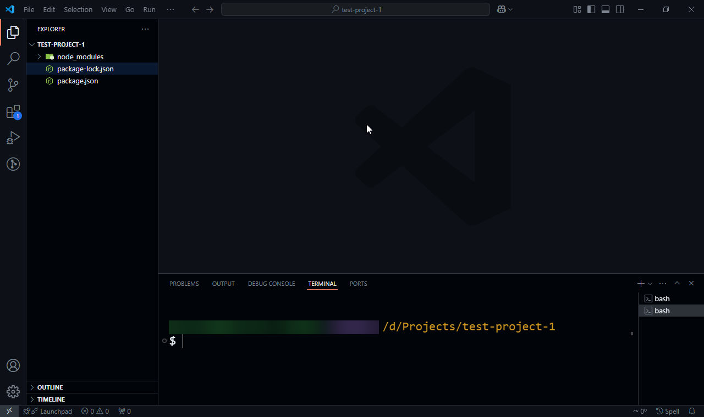
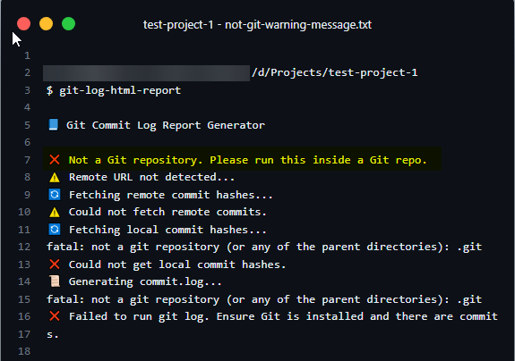
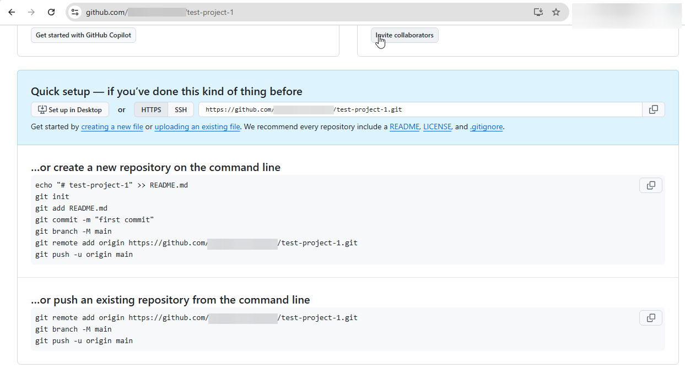
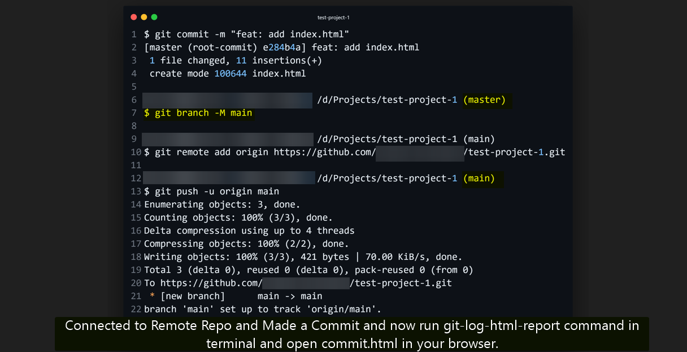
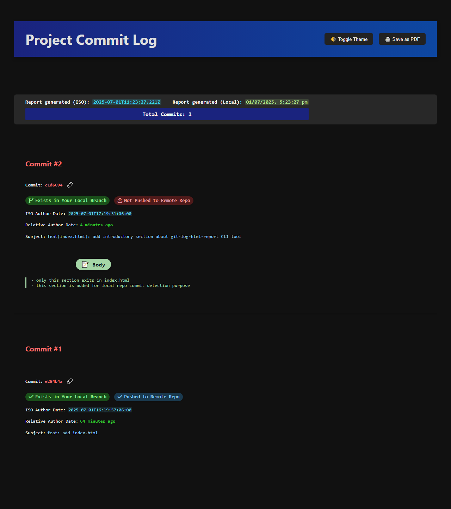
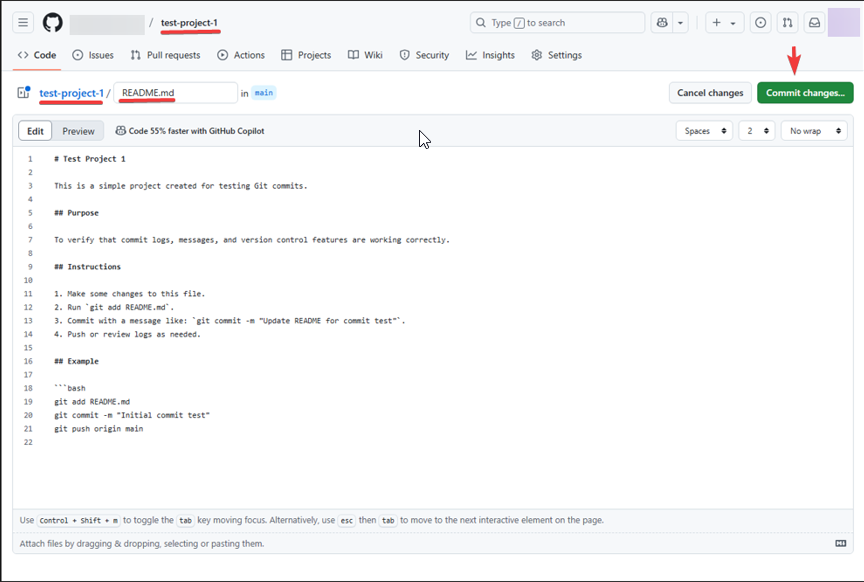
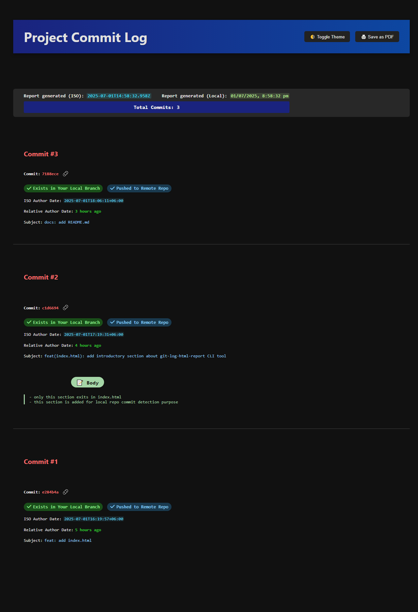

[Zurück zur Sprachauswahl](README.md) | 🇺🇸 [English](README.en.md)

---

<p align="center">
  
</p>

# git-log-html-report

## 🌐 Sprache

| 🌍 Verfügbare Übersetzungen            | 🔄 Wechsel           |
| -------------------------------------- | -------------------- |
| 🇺🇸 [Englisch (Standard)](README.en.md) | ⬅️ Zum Lesen klicken |
| 🇩🇪 Deutsch                             | ✅                   |

[](https://www.npmjs.com/package/git-log-html-report)
[](https://www.npmjs.com/package/git-log-html-report)
[](https://github.com/sajjad-developer/git-log-html-report/blob/main/LICENSE)

[](https://github.com/sajjad-developer/git-log-html-report)
[](https://packagephobia.com/result?p=git-log-html-report)

> **Alle Ihre Commits – vollständig synchronisiert. Verfolgen Sie jede Änderung in lokalen und Remote-Repositories, ohne zwischen GitHub-Tabs wechseln zu müssen. `git-log-html-report` sorgt für Klarheit und Vertrauen – sowohl für Einzelentwickler als auch für Teams.**

> 🔎 **Sofortige Git-Commit-Einblicke als übersichtlicher HTML-Bericht!**
> Wandeln Sie Ihre Git-Historie in eine saubere, teilbare und anpassbare HTML-Datei mit Erkennung von lokalen und entfernten Commits um.

📄 **git-log-html-report** ist ein leistungsstarkes CLI-Tool, das Ihre Git-Commit-Historie in einen schönen, lesbaren und barrierefreien HTML-Bericht umwandelt.

---

## 📚 Inhaltsverzeichnis

- [✨ Funktionen](#-funktionen)
- [👥 Zielgruppe](#-zielgruppe)
- [🚀 Installation](#-installation)
- [📦 Nutzung](#-nutzung)
- [📋 Voraussetzungen](#-voraussetzungen)
- [📸 Schritt-für-Schritt-Screenshots & Funktionsübersicht](#-schritt-für-schritt-screenshots--funktionsübersicht)
- [📄 Lizenz](#-lizenz)
- [☕ Unterstützen Sie meine Arbeit](#-unterstützen-sie-meine-arbeit)

> ⚠️ Auf der [npm-Paketseite](https://www.npmjs.com/package/git-log-html-report) funktionieren Ankerlinks eventuell nicht korrekt.
> 👉 Nutzen Sie für die vollständige Navigation bitte das [README auf GitHub](https://github.com/sajjad-developer/git-log-html-report#readme).

---

## ✨ Funktionen

- 🔍 Anzeige von kurzen Commit-Hashes, Betreff, Beschreibung sowie ISO- und lokalen Zeitstempeln
- 🎨 Umschalten zwischen dunklem und hellem Design
- 🔗 Klickbare Commit-Links mit Kopierfunktion
- 📄 Bericht als PDF speichern oder drucken
- Anzeige des Commit-Status:

  - ✅ Im lokalen Repository vorhanden
  - 📤 Noch nicht zum Remote gepusht
  - ☁️ Im Remote vorhanden (noch nicht gepullt)
  - ☑️ Vollständig zum Remote gepusht
  - ❓ Unbekannter Status (selten)

- ♿️ Barrierefreies Design für Screenreader und Tastaturnavigation

---

## 👥 Zielgruppe

Egal ob Sie als **Einzelentwickler** Ihre Änderungen nachvollziehen oder Teil eines **Teams** sind – dieses Tool unterstützt Sie dabei, Git-Aktivitäten effizient zu verfolgen und zu verstehen.

---

## 🚀 Installation

Global über npm installieren:

```bash
npm install -g git-log-html-report
```

Oder ohne globale Installation direkt per npx ausführen:

```bash
npx git-log-html-report
```

---

## 📦 Nutzung

Führen Sie den Befehl in einem beliebigen Git-Repository aus:

```bash
git-log-html-report
```

Es werden `commit.log` und `commit.html` im Stammverzeichnis erzeugt. Die generierte HTML-Datei wird nicht im Remote-Repository gespeichert.

Um den Bericht anzuzeigen, öffnen Sie `commit.html` in einem Browser über einen lokalen Server, zum Beispiel:

Mit Vite:

```
http://localhost:5173/commit.html
```

Mit Live Server:

```
127.0.0.1:8080/commit.html
```

---

## 📋 Voraussetzungen

- Node.js Version 14 oder höher
- Ein gültiges Git-Repository

---

## 📸 Schritt-für-Schritt-Screenshots & Funktionsübersicht

Unten finden Sie 18 sorgfältig ausgewählte Screenshots (einschließlich 15.1 und 15.2), die zeigen, wie **git-log-html-report** in der Praxis funktioniert.

**Sie können:**

- 📘 Der Schritt-für-Schritt-Sequenz folgen, um den typischen Git-Workflow zu verstehen
- 🔍 Jeden Screenshot als Referenz für konkrete Anwendungsfälle nutzen
- ✨ Die Funktionen visuell nachvollziehen
- ✅ Wichtige Schritte anhand kategorisierter Abschnitte erkennen
- 🔗 Schnellnavigation über die untenstehenden Links verwenden
- 🔽 Jeden Abschnitt zum fokussierten Lesen ein- oder ausklappen

### 📑 Screenshot-Abschnitte

- [📂 Setup & Initialisierung](#-setup--initialisierung)
- [📝 Lokale Commits & Änderungen](#-lokale-commits--änderungen)
- [🚀 Remote-Synchronisation & Push](#-remote-synchronisation--push)
- [🌐 Nur Remote-Commits & Pull](#-nur-remote-commits--pull)

---

<h3 id="setup--initialisierung">📂 Setup & Initialisierung</h3>
<details><summary>Klicken zum Ein-/Ausklappen</summary>
<br/>

<figure align="center">
  
  <br/>
  <br/>
  <figcaption><b>Abbildung 1: Anfangszustand des Projektordners mit der grundlegenden Verzeichnisstruktur vor Ausführung der Befehle.</b></figcaption>
</figure>
<br/>
<br/>
<br/>

<figure align="center">
  
  <br/>
  <br/>
  <figcaption><b>Abbildung 2: Ausführen des CLI-Befehls <code>git-log-html-report</code> im Terminal zur Generierung des HTML-Berichts.</b></figcaption>
</figure>
<br/>
<br/>
<br/>

<figure align="center">
  
  <br/>
  <br/>
  <figcaption><b>Abbildung 3: Warnmeldung, die erscheint, wenn das Tool außerhalb eines Git-Repositories ausgeführt wird.</b></figcaption>
</figure>
<br/>
<br/>
<br/>

<figure align="center">
  
  <br/>
  <br/>
  <figcaption><b>Abbildung 4: Hinweis, dass kein Remote-Repository für das lokale Git-Repository konfiguriert ist.</b></figcaption>
</figure>
<br/>
<br/>
<br/>

<figure align="center">
  
  <br/>
  <br/>
  <figcaption><b>Abbildung 5: Empfohlene Git-Befehle zum Einrichten einer Remote-Repository-Verbindung.</b></figcaption>
</figure>

</details>

---

<h3 id="lokale-commits--änderungen">📝 Lokale Commits & Änderungen</h3>
<details><summary>Klicken zum Ein-/Ausklappen</summary>
<br/>

<figure align="center">
  
  <br/>
  <br/>
  <figcaption><b>Abbildung 6: Verwendung von <code>git add</code>, um die Datei index.html für den ersten Commit vorzubereiten.</b></figcaption>
</figure>
<br/>
<br/>
<br/>

<figure align="center">
  
  <br/>
  <br/>
  <figcaption><b>Abbildung 7: Erfolgreicher lokaler Commit nach Verbindung des Repositories mit einem Remote-Repository.</b></figcaption>
</figure>
<br/>
<br/>
<br/>

<figure align="center">
  
  <br/>
  <br/>
  <figcaption><b>Abbildung 8: Terminal-Rückmeldung zur Bestätigung der Erstellung der Datei <code>commit.html</code>.</b></figcaption>
</figure>
<br/>
<br/>
<br/>

<figure align="center">
  
  <br/>
  <br/>
  <figcaption><b>Abbildung 9: Vorschau des generierten HTML-Berichts zur Visualisierung der Git-Commit-Historie.</b></figcaption>
</figure>
<br/>
<br/>
<br/>

<figure align="center">
  
  <br/>
  <br/>
  <figcaption><b>Abbildung 10: Beispiel für einen zweiten lokalen Commit-Eintrag.</b></figcaption>
</figure>
<br/>
<br/>
<br/>

<figure align="center">
  
  <br/>
  <br/>
  <figcaption><b>Abbildung 11: Erneutes Ausführen des CLI-Befehls <code>git-log-html-report</code> nach dem zweiten Commit im lokalen Repository.</b></figcaption>
</figure>
<br/>
<br/>
<br/>

<figure align="center">
  
  <br/>
  <br/>
  <figcaption><b>Abbildung 12: Hervorhebung eines Commits, der nur lokal existiert und noch nicht zum Remote-Repository gepusht wurde.</b></figcaption>
</figure>

</details>

---

<h3 id="remote-synchronisation--push">🚀 Remote-Synchronisation & Push</h3>
<details><summary>Klicken zum Ein-/Ausklappen</summary>
<br/>

<figure align="center">
  
  <br/>
  <br/>
  <figcaption><b>Abbildung 13: Ausführen des Befehls <code>git push</code>, um lokale Commits mit dem Remote-Repository zu synchronisieren.</b></figcaption>
</figure>
<br/>
<br/>
<br/>

<figure align="center">
  
  <br/>
  <br/>
  <figcaption><b>Abbildung 14: Bestätigung, dass Commits erfolgreich zum Remote-Repository gepusht wurden.</b></figcaption>
</figure>

</details>

---

<h3 id="nur-remote-commits--pull">🌐 Nur Remote-Commits & Pull</h3>
<details><summary>Klicken zum Ein-/Ausklappen</summary>
<br/>

<figure align="center">
  
  <br/>
  <br/>
  <figcaption><b>Abbildung 15.1: Erster Schritt, der einen direkt im Remote-Repository per Webschnittstelle erstellten Commit zeigt.</b></figcaption>
</figure>
<br/>
<br/>
<br/>

<figure align="center">
  
  <br/>
  <br/>
  <figcaption><b>Abbildung 15.2: Zweiter Schritt, der die Betreffzeile der Commit-Nachricht des nur im Remote-Repository direkt erstellten Commits zeigt.</b></figcaption>
</figure>
<br/>
<br/>
<br/>

<figure align="center">
  
  <br/>
  <br/>
  <figcaption><b>Abbildung 16: Hervorhebung des Commits, der im Remote-Repository vorhanden, aber noch nicht in das lokale Repository gezogen wurde.</b></figcaption>
</figure>
<br/>
<br/>
<br/>

<figure align="center">
  
  <br/>
  <br/>
  <figcaption><b>Abbildung 17: Ausführen des Befehls <code>git pull</code>, um entfernte Commits in das lokale Repository zu holen und zu integrieren.</b></figcaption>
</figure>
<br/>
<br/>
<br/>

<figure align="center">
  
  <br/>
  <br/>
  <figcaption><b>Abbildung 18: Bestätigung, dass ein entfernter Commit erfolgreich in das lokale Repository übernommen wurde.</b></figcaption>
</figure>

</details>

---

## 📄 Lizenz

MIT © [Md Sajjad Hossen](https://github.com/sajjad-developer)

---

## ☕ Unterstützen Sie meine Arbeit

✨ Dieses Projekt wird von mir in meiner Freizeit entwickelt und gepflegt.
Wenn `git-log-html-report` Ihnen Zeit spart oder Ihren Workflow verbessert hat, erwägen Sie bitte eine **freiwillige Unterstützung**, um die Weiterentwicklung zu fördern:

[](https://eco-starfish-coder.com/tip)
