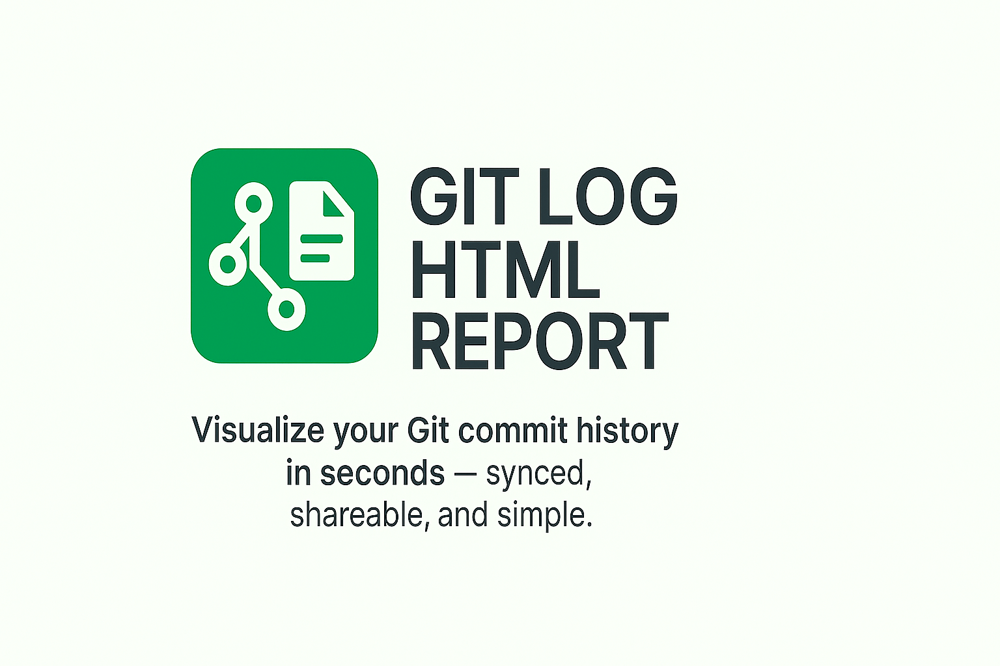
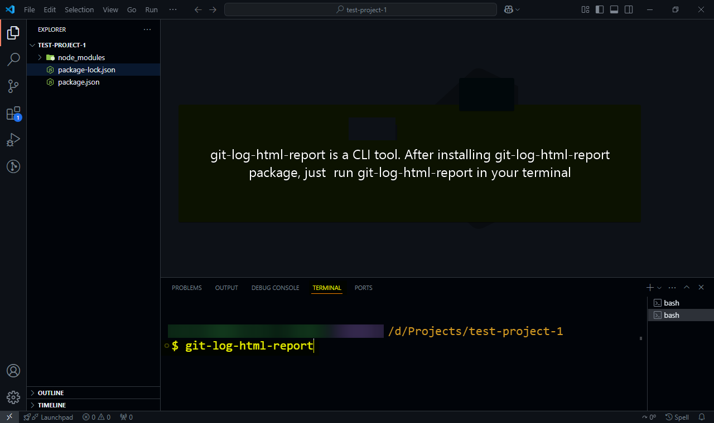

[Back to language selection](README.md) | 🇩🇪 [Deutsch](README.de.md)

---

<p align="center">
  
</p>

# git-log-html-report

## 🌐 Language

| 🌍 Available Translations           | 🔄 Switch        |
| ----------------------------------- | ---------------- |
| 🇺🇸 English (default)                | ✅               |
| 🇩🇪 [Deutsch (German)](README.de.md) | ⬅️ Click to view |

[](https://www.npmjs.com/package/git-log-html-report)
[](https://www.npmjs.com/package/git-log-html-report)
[](https://github.com/sajjad-developer/git-log-html-report/blob/main/LICENSE)

[](https://github.com/sajjad-developer/git-log-html-report)
[](https://packagephobia.com/result?p=git-log-html-report)

> **All your commits—fully synced. Track every change across local and remote repositories without switching tabs to your GitHub repo. `git-log-html-report` brings clarity and confidence to solo developers and teams alike.**

> 🔎 **Instant Git Commit Insights — as an HTML report!**  
> Convert your Git history into a clean, shareable, themeable HTML file with local & remote commit detection.

📄 **git-log-html-report** is a powerful CLI tool that transforms your Git commit history into a beautiful, readable, and accessible HTML report.

---

## 📚 Table of Contents

- [✨ Features](#-features)
- [👥 Who Is It For?](#-who-is-it-for)
- [🚀 Installation](#-installation)
- [📦 Usage](#-usage)
- [📋 Requirements](#-requirements)
- [📸 Step-by-Step Screenshots, Quick Reference & Feature Highlights](#-step-by-step-screenshots-quick-reference--feature-highlights)
- [📄 License](#-license)
- [☕ Support My Work](#-support-my-work)

> ⚠️ On the [npm package page](https://www.npmjs.com/package/git-log-html-report), anchor links may not scroll.  
> 👉 For full navigation, [view this README on GitHub](https://github.com/sajjad-developer/git-log-html-report#readme).

---

## ✨ Features

- 🔍 Shows short commit hash, subject, body, and ISO and local timestamps
- 🎨 Toggle between dark/light themes
- 🔗 Clickable short commit hashes with copy-to-clipboard functionality
- 📄 Save or print the report as a PDF
- Displays commit status:
  - ✅ Exists in your local repo
  - 📤 Not pushed to remote
  - ☁️ Exists on remote (awaiting pull)
  - ☑️ Fully pushed to remote
  - ❓ Unknown status (rare)
- ♿ Accessible design for screen readers and keyboard navigation

---

## 👥 Who Is It For?

Whether you're a **solo developer** reviewing your changes or part of a **collaborative team**, this tool helps you track and understand Git activity effortlessly.

---

## 🚀 Installation

Install globally via npm:

```bash
npm install -g git-log-html-report
```

Or run directly without global installation using npx

```bash
npx git-log-html-report
```

---

## 📦 Usage

Inside any Git repository, just run:

```bash
git-log-html-report
```

It will generate `commit.log` and `commit.html` in the root directory. The generated HTML report file is **not committed** to your remote Git repository. To view the report, open `commit.html` using a local server in your browser—for example:

using Vite server:

```
http://localhost:5173/commit.html
```

using Live Server extension:

```
127.0.0.1:8080/commit.html
```

---

## 📋 Requirements

- Node.js v14 or higher
- A valid Git repository

---

## 📸 Step-by-Step Screenshots, Quick Reference & Feature Highlights

Below are 18 carefully curated figures (1 to 18, including 15.1 and 15.2 as separate images) that demonstrate how **git-log-html-report** works in real usage.

**You can:**

- 📘 Follow the full step-by-step sequence to understand the typical Git workflow
- 🔍 Use any screenshot as a quick reference for specific scenarios (e.g., local-only commits, HTML output, syncing)
- ✨ See how the tool’s features come together visually and interactively
- ✅ Explore key steps and features through the categorized sections
- 🔗 Use links for quick navigation
- 🔽 Expand or collapse each group for focused viewing

### 📑 Screenshot Sections

- [📂 Setup & Initialization](#setup--initialization)
- [📝 Local Commits & Changes](#local-commits--changes)
- [🚀 Remote Sync & Push](#remote-sync--push)
- [🌐 Remote-Only Commits & Pull](#remote-only-commits--pull)

---

<h3 id="setup--initialization">📂 Setup & Initialization</h3>
<details><summary>Click to expand</summary>
<br/>

<figure align="center">
  
  <br/>
  <br/>
  <figcaption><b>Figure 1: Initial project folder showing the basic directory structure before running any commands.</b></figcaption>
</figure>
<br/>
<br/>
<br/>

<figure align="center">
  
  <br/>
  <br/>
  <figcaption><b>Figure 2: Executing the <code>git-log-html-report</code> CLI command in the terminal to generate the HTML report.</b></figcaption>
</figure>
<br/>
<br/>
<br/>

<figure align="center">
  
  <br/>
  <br/>
  <figcaption><b>Figure 3: Warning message displayed when running the tool outside a Git repository.</b></figcaption>
</figure>
<br/>
<br/>
<br/>

<figure align="center">
  
  <br/>
  <br/>
  <figcaption><b>Figure 4: Notification shown when no remote repository is configured for the local Git repository.</b></figcaption>
</figure>
<br/>
<br/>
<br/>

<figure align="center">
  
  <br/>
  <br/>
  <figcaption><b>Figure 5: Recommended Git commands for setting up a remote repository connection.</b></figcaption>
</figure>

</details>

---

<h3 id="local-commits--changes">📝 Local Commits & Changes</h3>
<details><summary>Click to expand</summary>
<br/>

<figure align="center">
  
  <br/>
  <br/>
  <figcaption><b>Figure 6: Using <code>git add</code> to stage index.html file for first commit.</b></figcaption>
</figure>
<br/>
<br/>
<br/>

<figure align="center">
  
  <br/>
  <br/>
  <figcaption><b>Figure 7: Successful local commit after connecting the repository to a remote.</b></figcaption>
</figure>
<br/>
<br/>
<br/>

<figure align="center">
  
  <br/>
  <br/>
  <figcaption><b>Figure 8: Terminal feedback confirming creation of the <code>commit.html</code> report file.</b></figcaption>
</figure>
<br/>
<br/>
<br/>

<figure align="center">
  
  <br/>
  <br/>
  <figcaption><b>Figure 9: Preview of the generated HTML report visualizing the Git commit history.</b></figcaption>
</figure>
<br/>
<br/>
<br/>

<figure align="center">
  
  <br/>
  <br/>
  <figcaption><b>Figure 10: Example of second local commit entry</b></figcaption>
</figure>
<br/>
<br/>
<br/>

<figure align="center">
  
  <br/>
  <br/>
  <figcaption><b>Figure 11: Re-running <code>git-log-html-report</code> CLI command in the terminal after making second commit in the local repository.</b></figcaption>
</figure>
<br/>
<br/>
<br/>

<figure align="center">
  
  <br/>
  <br/>
  <figcaption><b>Figure 12: Highlighting the second commit that exist only locally and are not yet pushed to the remote repository.</b></figcaption>
</figure>

</details>

---

<h3 id="remote-sync--push">🚀 Remote Sync & Push</h3>
<details><summary>Click to expand</summary>
<br/>

<figure align="center">
  
  <br/>
  <br/>
  <figcaption><b>Figure 13: Executing <code>git push</code> to sync local commits with the remote repository.</b></figcaption>
</figure>
<br/>
<br/>
<br/>

<figure align="center">
  
  <br/>
  <br/>
  <figcaption><b>Figure 14: Confirmation message showing that commits have been successfully pushed to the remote repository.</b></figcaption>
</figure>

</details>

---

<h3 id="remote-only-commits--pull">🌐 Remote-Only Commits & Pull</h3>
<details><summary>Click to expand</summary>
<br/>

<figure align="center">
  
  <br/>
  <br/>
  <figcaption><b>Figure 15.1: First step showing a commit made directly in the remote repository via the web interface.</b></figcaption>
</figure>
<br/>
<br/>
<br/>

<figure align="center">
  
  <br/>
  <br/>
  <figcaption><b>Figure 15.2: Second step illustrating the commit message subject of the remote-only commit made directly in the remote repository.</b></figcaption>
</figure>
<br/>
<br/>
<br/>

<figure align="center">
  
  <br/>
  <br/>
  <figcaption><b>Figure 16: Highlighting the commit present in the remote repository but not yet pulled into the local repository.</b></figcaption>
</figure>
<br/>
<br/>
<br/>

<figure align="center">
  
  <br/>
  <br/>
  <figcaption><b>Figure 17: Using <code>git pull</code> to fetch and merge that remote commit into the local repository.</b></figcaption>
</figure>
<br/>
<br/>
<br/>

<figure align="center">
  
  <br/>
  <br/>
  <figcaption><b>Figure 18: Confirmation of a remote commit successfully fetched and integrated into the local repository.</b></figcaption>
</figure>

</details>

---

## 📄 License

MIT © [Md Sajjad Hossen](https://github.com/sajjad-developer)

---

## ☕ Support My Work

✨ This project is developed and maintained by me during my personal time.  
If `git-log-html-report` has saved you time or improved your workflow, consider leaving a **voluntary tip** to support ongoing development:

[](https://eco-starfish-coder.com/tip)
