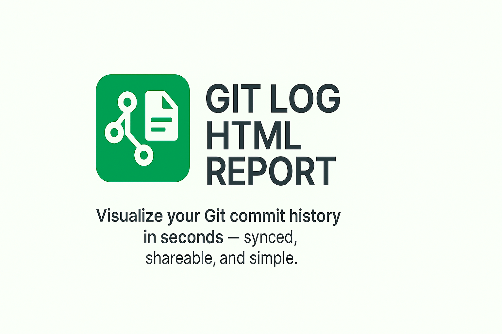

<p align="center">
  
</p>

<h1 align="center">git-log-html-report</h1>

<p align="center">
  <a href="https://www.npmjs.com/package/git-log-html-report" target="_blank" rel="noopener noreferrer">
    
  </a>
  <a href="https://github.com/sajjad-developer/git-log-html-report/actions/workflows/ci.yml" target="_blank" rel="noopener noreferrer">
    
  </a>
  <a href="https://github.com/sajjad-developer/git-log-html-report/blob/main/LICENSE" target="_blank" rel="noopener noreferrer">
    
  </a>
  <a href="https://github.com/sajjad-developer/git-log-html-report/issues?q=is%3Aissue+is%3Aopen+label%3A%22good+first+issue%22" target="_blank" rel="noopener noreferrer">
    
  </a>
  <a href="https://github.com/sajjad-developer/git-log-html-report/issues?q=is%3Aissue+is%3Aopen+label%3Ahelp-wanted" target="_blank" rel="noopener noreferrer">
    
  </a>
  <a href="https://packagephobia.com/result?p=git-log-html-report" target="_blank" rel="noopener noreferrer">
  
  </a>
  <!-- Add the npm downloads badge here -->
  <a href="https://www.npmjs.com/package/git-log-html-report" target="_blank" rel="noopener noreferrer">
    
  </a>
</p>

<p align="center"><strong>✨ Connect once. View forever. Your GitHub commit history, now in your hands.</strong></p>

<p align="center">
  <code>git-log-html-report</code> — A powerful CLI tool that instantly converts your Git commit history into clean, themed, and printable HTML reports with detailed timestamps and commit metadata. It syncs local and remote changes for effortless tracking, designed for solo developers and teams.
</p>

---

### 🚀 Installation

Install globally via npm:

```bash
npm install -g git-log-html-report
```

Or run directly without global installation using npx

```bash
npx git-log-html-report
```

---

### 🔗 Quick Links

- [📦 Usage](README.en.md#-usage)
- [📋 Requirements](README.en.md#-requirements)
- [📸 Step-by-Step Screenshots, Quick Reference & Feature Highlights](README.en.md#-step-by-step-screenshots-quick-reference--feature-highlights)

---

### ✨ Key Features

- 📦 **All your commits—fully synced.** Track every change across local and remote without switching tabs to your GitHub repo.
- 🔎 **Instant Git Commit Insights — as an HTML report!**
- 🎨 **Convert your Git history into a clean, shareable, themeable HTML file with local & remote commit detection.**

---

<p align="center">
  <strong>👋 Welcome / Willkommen</strong><br>
  <em>🌍 Please choose your preferred language / Bitte wählen Sie Ihre bevorzugte Sprache:</em>
</p>

<p align="center">
  🇺🇸 <a href="README.en.md">English</a> &nbsp;|&nbsp; 🇩🇪 <a href="README.de.md">Deutsch</a>
</p>

---

<p align="center">
  🌐 Want to help translate this project? <br>
  <a href="CONTRIBUTING.md"><strong>🤝 Contribute your language here</strong></a>
</p>

### 🙌 Contributing

Contributions are welcome and appreciated!
You can help by improving the code, reporting bugs, suggesting features, or fixing documentation.

Please see [CONTRIBUTING.md](CONTRIBUTING.md) for full guidelines.

> 💡 All contributions are voluntary.
> **Financial tips are a personal gesture to the maintainer and are not shared with contributors.**

---

### ☕ Support My Work

✨ This project is developed and maintained by me during my personal time.
If `git-log-html-report` has saved you time or improved your workflow, please consider leaving a **voluntary tip** to support ongoing development:

[](https://eco-starfish-coder.com/tip)

> ⚠️ **Note:** Tips are optional and go directly to the maintainer (me).
> This project is open-source and free to use. Contributions are welcome, but not financially compensated.
